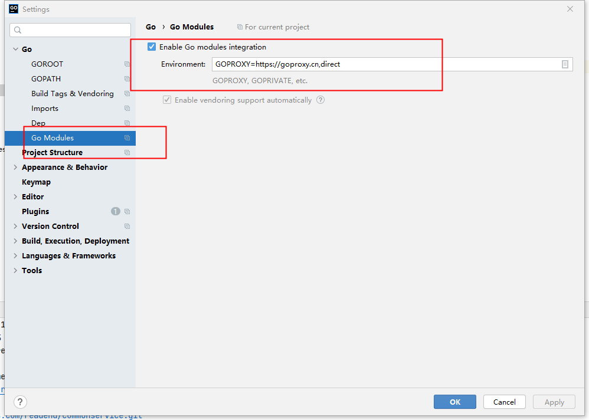

### 介绍
gin 结合 gorm简单封装，方便开箱即用API服务

### 目录
1. admin          -- 管理后台api
2. api            -- 客户端api
3. cmd            -- 部署相关脚本
4. conf           -- 配置文件
5. docs           -- 文档
6. middleware     -- 中间件
7. models         -- 数据层
8. pkg            -- 一些工具包
9. routers        --路由（多模块 如:admin、api）
10. service       -- 方便api与models交互
11. sql           -- 示例sql
### 版本要求
* 1.18及以上版本，查看go版本： go version
* [go下载地址](https://golang.google.cn/dl/)
### go mod 
* Goland go mod 支持设置：GOPROXY=https://goproxy.cn,direct
  
* 执行go mod tidy 获取依赖包
### gin
* 参考文档：[https://gin-gonic.com/zh-cn/docs/](https://gin-gonic.com/zh-cn/docs/)
### 配置文件 conf/app.ini
* 复制 conf/app.ini.example，去掉.example后缀

### orm：gorm
* 参考文档：[https://learnku.com/docs/gorm/v2/index/9728](https://learnku.com/docs/gorm/v2/index/9728)

###  编译
##### windows下编译Linux平台可执行文件
```
CGO_ENABLED=0 GOOS=linux GOARCH=amd64 go build -o gin-gorm-base  main.go
```
##### mac下编译Linux平台可执行文件
```
CGO_ENABLED=0 GOOS=linux GOARCH=amd64 go build -o gin-gorm-base  main.go
```
##### mac下编译windows平台可执行文件
```
CGO_ENABLED=0 GOOS=windows GOARCH=amd64 go build  -o gin-gorm-base  main.go
```
### 本地测试
* http://127.0.0.1:port/ping 
```
{
    "msg": "pong"
}
```

### 热加载fresh
```
go install github.com/pilu/fresh@latest
```
- 使用 fresh 启动服务： 项目根目录下执行： fresh

### 调试
1. 日志文件保存在 ：runtime/logs 目录下


### ================部署相关===============
##### go安装  （1.18.7版本）
* 下载解压至指定目录，一般到/usr/local
  * ```sudo tar -C /usr/local -xzf  go**.linux-amd64.tar.gz```
* 设置环境变量
  - ```sudo gedit ~/.bashrc```
  * ```export PATH=$PATH:/usr/local/go/bin```
  * ```source ~/.bashrc```
* go mod 设置
  * go env -w GO111MODULE=on
  * go env -w GOPROXY=https://goproxy.cn,direct

##### git安装
* ```sudo yum install git```

##### 自定义 systemctl 管理服务
* 在 服务器/lib/systemd/system 目录下创建 gin-gorm-base.service 文件，内容如下:(./doc/gin-gorm-base.service)
```
[Unit]
Description=gin-gorm-base
After=network.target

[Service]
Type=simple
ExecStart=/data/goservice/gin-gorm-base/gin-gorm-base_run.sh
ExecStop=/bin/kill -15 $MAINPID
Restart=on-failure
#User=root
#Group=root

[Install]
WantedBy=multi-user.target
```
其中 /data/goservice/gin-gorm-base/ 为go服务部署的目录 gin-gorm-base_run.sh内容如下：
```
#!/bin/sh

cd /data/goservice/gin-gorm-base
./gin-gorm-base
```
* **gin-gorm-base_run.sh 给赋予777权限**
* 执行systemctl daemon-reload命令使得新加的服务生效

##### shell + git 部署go
* cd /data/gocode
* git clone git@10.0.0.31:goservice/gin-gorm-base.git
* 创建服务目录与code分离 mkdir  /data/goservice/gin-gorm-base  服务依赖的相关配置文件也放于此目录下conf目录中，服务日志目录也在此目录下  runtime
* 创建shell 脚本 update.sh  内容如下：(./doc/update.sh)
```
#!/bin/sh

cd /data/gocode/gin-gorm-base
git reset --hard
git pull
go mod tidy

echo '2. Building ...'

#删除旧的编译生成文件
if [ -f main ]; then
        rm main
fi

go build -o gin-gorm-base main.go

# 检查是否编译成功
if [ ! -f gin-gorm-base ]; then
        echo "ERR: build error, return now"
else
        # 编译成功了，这里开始备份当前正在运行的程序文件，一定要备份/data/goservice/gin-gorm-base/gin-gorm-base这个文件，而不是 /data/code/gin-gorm-base/gin-gorm-base。
        # 因为/data/goservice/gin-gorm-base/main肯定是正在运行的文件，备份它肯定没错。
        echo "3. Backup old version"
        if [ -f /data/goservice/gin-gorm-base/gin-gorm-base ]; then
                # mv /data/goservice/gin-gorm-base/gin-gorm-base /data/goservice/gin-gorm-base/gin-gorm-base.`date "+%Y-%m-%d_%H:%M:%S"`
                if [ -f /data/goservice/gin-gorm-base/gin-gorm-base.backup ]; then
                    rm /data/goservice/gin-gorm-base/gin-gorm-base.backup
                fi
                mv /data/goservice/gin-gorm-base/gin-gorm-base /data/goservice/gin-gorm-base/gin-gorm-base.backup
        fi
        mv gin-gorm-base /data/goservice/gin-gorm-base/gin-gorm-base

        echo "4. Restart service"
        systemctl restart gin-gorm-base
        echo "Service enable :"
        systemctl enable qmjcdyapi
        echo "Service status is :"
        systemctl status gin-gorm-base
        echo ""
        echo "Restart OK, visit http://127.0.0.1:8000/ping for test"
fi
```
**注意 ： 首次部署上述shell中 systemctl start gin-gorm-base, 后续更新替换为 systemctl restart gin-gorm-base**
* 执行更新脚本，更新发布服务

##### 版本回撤
* 创建回撤脚本文件，内容如下：（./doc/backup.sh）
```
#!/bin/sh

cd /data/goservice/gin-gorm-base

mv gin-gorm-base gin-gorm-base.0

# mv $1 gin-gorm-base
mv gin-gorm-base.backup gin-gorm-base

systemctl daemon-reload

systemctl restart gin-gorm-base.service

# echo "gin-gorm-base backup to "$1
echo "gin-gorm-base backup to gin-gorm-base.backup"
```

* 回撤到某个版本，以回撤到 main.2023-04-18_17:32:23为例
```
#sh backup.sh gin-gorm-base.2023-04-18_17:32:23
sh backup.sh
```

* 数据库表模型创建
```
go install gorm.io/gen/tools/gentool@latest

GOPATH下的bin生成了gentool命令，可以加到环境变量中
执行命令
gentool -dsn "root:123456@tcp(127.0.0.1:3306)/base?charset=utf8mb4&parseTime=True&loc=Local" -tables "tableName" -onlyModel

 ``` 
